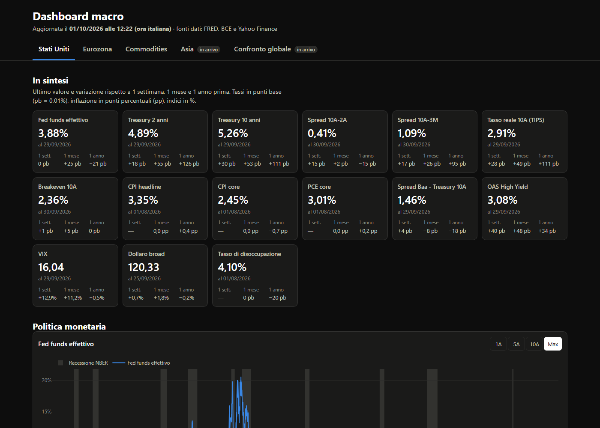

# Macro Dashboard

A static macroeconomic dashboard covering the US, the Eurozone, commodities, Japan, China, South Korea and a global comparison, rebuilt every day and published on GitHub Pages.

**Live site: [federicoamatruda47-commits.github.io/macro-dashboard](https://federicoamatruda47-commits.github.io/macro-dashboard/)** (the site text is in Italian)



## Contents

| Tab | Main indicators |
|---|---|
| **United States** | Fed funds rate, Treasury yield curve (2Y, 10Y), 10Y-2Y and 10Y-3M spreads, 10Y real yield (TIPS) and breakeven inflation, CPI and core PCE, credit spreads (Baa-Treasury, High Yield OAS), VIX, broad dollar index, unemployment. NBER recessions shaded. |
| **Eurozone** | ECB deposit facility rate, AAA euro yield curve (Bund proxy), sovereign spreads (BTP/OAT vs Bund), HICP headline and core, euro high-yield spread, EUR/USD. CEPR recessions shaded. |
| **Commodities** | Performance table, energy (WTI, Brent, Henry Hub, TTF), precious metals (gold, silver), industrial metals (copper, aluminium), agriculturals (wheat, corn), and commodities vs US rates charts. |
| **Japan** | BoJ policy rate, daily JGB yields (2Y, 10Y, 30Y), CPI headline, core and core-core (all from the Statistics Bureau), USD/JPY, Nikkei 225. |
| **China** | Loan Prime Rate (1Y), CPI, USD/CNY, CSI 300 (via an ETF) and Hang Seng. |
| **South Korea** | BoK base rate, 10Y yield (monthly), CPI, USD/KRW, KOSPI. |
| **Global comparison** | Policy rates of the US, Eurozone, Japan, China and Korea on one chart; 10Y yields; CPI inflation; currencies vs the dollar and equity indices rebased to 100 at the start of the selected period. |

No recession shading for Asia: there is no official, machine-readable source. Not included for lack of fresh free sources: China 10Y yield, 5Y LPR and PPI; Korean 3Y yield (daily data only through the Bank of Korea API, which needs a Korean registration).

Each tab opens with a summary of the latest value and the 1-week, 1-month and 1-year changes. Charts have 1Y / 5Y / 10Y / Max range buttons and light/dark themes.

## Data sources and known limits

| Source | Used for | Known limits |
|---|---|---|
| [FRED](https://fred.stlouisfed.org/) (official API, key required) | US data; fallback for the other tabs | ICE BofA OAS series start in October 2023 (licence), so `BAA10Y` is used for long history. `DTWEXBGS` is weekly with a few days' delay. |
| [ECB Data Portal](https://data.ecb.europa.eu/) (no key) | Policy rate, AAA yield curve, HICP | Daily country yields (Bund, BTP, OAT) are not free: sovereign spreads use monthly convergence-criteria yields, about one month late. No free euro investment-grade spread; euro HY only from October 2023. The old `ICP` HICP dataset is frozen at December 2025; the new `HICP` dataset is used. |
| [Yahoo Finance](https://finance.yahoo.com/) via `yfinance` (unofficial) | Commodity continuous futures, equity indices, USD exchange rates | Not an official API and may break. Contract rollovers cause small price jumps (noted under the charts). No free fallback for gold and silver or for the indices. The CSI 300 index has no history on Yahoo: the ETF `510300.SS` is used instead (from 2012). |
| [BIS](https://stats.bis.org/) (no key) | Central bank policy rates of all five economies; CPI inflation (year on year) of the Asian countries and the global comparison | The BIS publishes Korea about one month late, so that series has a custom 45-day freshness threshold. China is the 1Y Loan Prime Rate, not an overnight rate. |
| [Japanese Ministry of Finance](https://www.mof.go.jp/english/policy/jgbs/reference/interest_rate/) (no key) | Daily JGB yields | CSV files in Shift-JIS; the history file is joined with the current-month file. |
| [Statistics Bureau of Japan](https://www.stat.go.jp/english/) via [DBnomics](https://db.nomics.world/) (no key) | Japanese CPI indices (headline, core, core-core); the Japan tab uses them, the global comparison uses BIS for uniformity | DBnomics is a free aggregator, not the statistics office itself. |

CEPR recession dates have no API and are maintained by hand in `config.yaml`.

## Data quality

- **Freshness check.** Every series is checked against a staleness threshold (10 days for daily, 21 weekly, 75 monthly, 120 quarterly, counted from the end of the observation period). A series can override its threshold with `soglia_giorni` in `config.yaml`, with the reason written next to it. Stale series trigger a warning at the top of the page, which catches frozen series that return no error.
- **Automatic fallback sources.** A series can declare a `riserva` (backup). If the primary source fails, the backup is used and the page says so, including any difference in unit.
- **Computed series use a single source.** Spreads and ratios (`fonte: calcolata`) are computed only if all components come from the same primary source. If one component fell back to a backup, the computed series is shown as unavailable with an explanation, so spot and futures prices, different sources or different units are never mixed.
- **Failures are isolated.** A failing series never blocks the build; it becomes "not available" with a warning. `build.py` exits with an error only if no series can be downloaded, in which case nothing is published.

## Automatic updates

A GitHub Actions workflow (`.github/workflows/aggiorna-dashboard.yml`) runs Monday to Saturday at 23:30 UTC, on manual dispatch, and on every push to `main`. It installs the dependencies, runs `python build.py` to download data and generate `site/`, then deploys the result to GitHub Pages. The run time is after the close of US futures and Asian markets. The FRED key is stored as the repository secret `FRED_API_KEY`.

## Architecture

```
config.yaml          regions, CEPR recessions, series definitions
build.py             single entry point: download -> compute -> generate site/
dashboard/
  sources/           one module per source, each exposing scarica(id) -> pandas.Series
  data.py            series loading, fallbacks, computed series, transformations, freshness
  charts.py          reusable Plotly charts
  regions/           one module per tab, composing sections and charts
  render.py          writes site/ from the Jinja2 template
templates/           HTML template
static/              CSS and JavaScript (tabs, charts, theme)
```

### Adding a series

1. Add a block to `config.yaml` with `id`, `fonte`, `nome`, `regione`, `categoria`, `unita`, `trasformazione` and optionally `riserva`.
2. To show it in a chart, add it in `dashboard/regions/<region>.py`.
3. For a spread or ratio use `fonte: calcolata` with `componenti: [A, B]` (A − B, or `operazione: rapporto` for A / B).

Before adding a series, check both its full history and its latest data point at the source.

## Running locally

Requires Python 3.14 and a free [FRED API key](https://fred.stlouisfed.org/docs/api/api_key.html).

```powershell
python -m venv .venv
.\.venv\Scripts\Activate.ps1
pip install -r requirements.txt
"FRED_API_KEY=your_key" | Out-File .env -Encoding ascii
python build.py
python -m http.server 8000 --directory site
```

Then open http://localhost:8000.

## Roadmap

- **More economies:** dedicated pages for other countries.
- **China and Korea gaps:** add the missing series if a free, fresh source appears.
