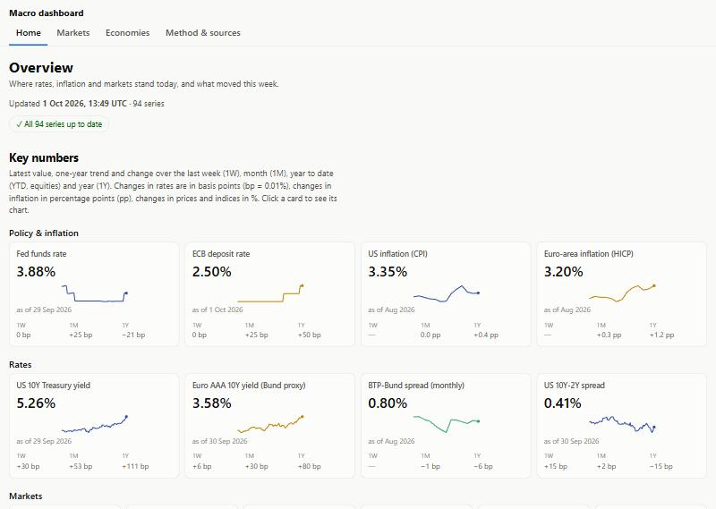

# Macro Dashboard

A static macroeconomic dashboard — rates, yield curves, inflation, credit, equities, currencies and commodities — rebuilt every day and published on GitHub Pages. Every chart comes with a plain-language "How to read it" line, a link to its source and notes on the known limits of the data.

**Live site: [federicoamatruda47-commits.github.io/macro-dashboard](https://federicoamatruda47-commits.github.io/macro-dashboard/)** (in English)



## What is on the site

| Page | What it shows |
|---|---|
| **Overview** | 14 key numbers (Fed and ECB rates, US and euro-area inflation, 10-year yields, BTP-Bund spread, S&P 500, Euro Stoxx 50, EUR/USD, gold, Brent, VIX) with a one-year trend and changes; **What changed this week**: the biggest weekly moves compared with each series' own normal volatility; a short data-status line. |
| **Markets › Rates & curves** | Policy rates of five economies, US and euro-area yield curves (today vs 1 month and 1 year ago), 10-year yields compared, curve slope and inversions, inflation and real rates (TIPS, breakeven). |
| **Markets › Credit** | US and euro-area high-yield spreads on one chart, US investment-grade and Baa spreads, BTP-Bund, OAT-Bund and euro-area sovereign spreads. |
| **Markets › Equities** | One performance table (last level, 1W, 1M, YTD, 1Y) for US, euro-area and Asian indices and MSCI ACWI; equity indices compared in local currency or in USD; US and European detail; S&P 500 concentration; VIX. |
| **Markets › FX** | Euro, yen, yuan and won against the dollar (base 100 and levels) and the broad dollar index. |
| **Markets › Commodities** | Performance table, energy, precious and industrial metals, agriculturals, and commodity-vs-US-rates charts. |
| **Economies** | One page per economy: the US (labour market for now); Italy, euro area, UK and a comparison view are coming; Japan, China and South Korea later. |
| **Method & sources** | Sources, the freshness check, fallback sources, calculated series, how "What changed this week" works and why its bar is 2×, the known limits of the data, and a table of every series with its status. |

Charts have 1Y / 5Y / 10Y / Max buttons and light and dark themes. A country always has the same colour on every chart. Every page and every chart has its own link (`…/markets/rates/#chart-mk-rates-slope`).

## Data sources and known limits

The full, always up-to-date list is on the site (Method & sources). In short:

| Source | Used for |
|---|---|
| [FRED](https://fred.stlouisfed.org/) (official API, key required) | US data and many fallbacks. ICE BofA spread series start in October 2023 (licence). |
| [ECB Data Portal](https://data.ecb.europa.eu/) (no key) | Policy rate, AAA yield curve (a Bund proxy), HICP inflation, EUR/USD. Daily country yields are not free: sovereign spreads use monthly figures. |
| [Yahoo Finance](https://finance.yahoo.com/) via `yfinance` (unofficial) | Equity indices, ETFs, commodity futures and exchange rates. It is not an official API and may break; most prices are closes without dividends. |
| [BIS](https://data.bis.org/) (no key) | Policy rates and CPI inflation for the cross-country comparisons. |
| [Japan Ministry of Finance](https://www.mof.go.jp/english/policy/jgbs/reference/interest_rate/) (no key) | Daily JGB yields. |
| [Statistics Bureau of Japan](https://www.stat.go.jp/english/) via [DBnomics](https://db.nomics.world/) (no key) | Japan CPI by component. |

Recession dates: NBER via FRED for the US; the CEPR for the euro area, kept by hand in `config.yaml` because it has no API. Not included for lack of fresh free sources: China's 10-year yield, 5-year LPR and PPI; Korea's 3-year yield.

## Data quality

- **Freshness check.** Every series is checked against a staleness threshold (10 days for daily, 21 weekly, 75 monthly, 120 quarterly, counted from the end of the observation period; a series can override it with `soglia_giorni`, with the reason written next to it). Stale series trigger a warning on the pages that use them, which catches frozen series that return no error.
- **Fallback sources.** A series can declare a `riserva` (backup). If the primary source fails, the backup is used, the chart footer says "(fallback)" and a notice appears, including any difference in unit.
- **Calculated series use a single source.** Spreads and ratios (`fonte: calcolata`) are computed only if all inputs come from the same primary source; otherwise they are shown as unavailable with an explanation, so spot and futures prices, different sources or different units are never mixed.
- **Failures are isolated.** A failing series never blocks the build. `build.py` exits with an error only if no series can be downloaded, in which case nothing is published.
- **Tests.** The weekly-moves calculation has unit tests on invented data (`python -m unittest discover -s tests -t .`), run in the workflow before the build: if one fails, nothing is published. With `PROVE_CON_RETE=1` they also check real episodes (oil and VIX in 2020).
- **Consistency checks.** `tools/inventario.py` checks that no chart or series was lost or duplicated and that every chart is on the page promised in `docs/mappa-grafici.yaml`; `tools/controlla_link.py` checks the internal links; `tools/valida_palette.py` checks that the country colours are distinguishable, also for colour-blind readers, and have enough contrast in both themes.

## Automatic updates

A GitHub Actions workflow (`.github/workflows/aggiorna-dashboard.yml`) runs Monday to Saturday at 23:30 UTC (after the US futures and Asian exchanges have closed), on manual dispatch and on every push to `main`. It installs the dependencies, runs the tests, runs `python build.py` to download data and generate `site/`, then deploys to GitHub Pages. The FRED key is stored as the repository secret `FRED_API_KEY`.

## Architecture

```
config.yaml          colours, pages, menu, key numbers, CEPR recessions, series definitions
build.py             single entry point: download -> compute -> generate site/
contenuti/note.yaml  the technical notes (shown in Method & sources)
dashboard/
  sources/           one module per source, each exposing scarica(id) -> pandas.Series
  data.py            series loading, fallbacks, calculated series, transformations, freshness
  charts.py          reusable Plotly charts
  mercati/           one module per Markets page
  economie/          one module per Economies page
  movimenti.py       "What changed this week"
  render.py          writes site/ from the Jinja2 templates
templates/ static/   HTML templates, CSS and JavaScript
tests/ tools/        unit tests and consistency checks
docs/                the restructuring plan and log, chart map
```

### Adding a series

1. Add a block to `config.yaml` with `id`, `fonte`, `nome`, `paese`, `categoria`, `unita`, `trasformazione` and optionally `riserva`, `colore`, `movimenti` / `gruppo_movimenti`.
2. To show it in a chart, add it to a page module in `dashboard/mercati/` (or `dashboard/economie/`) and give the chart a `come_leggerlo` line.
3. For a spread or ratio use `fonte: calcolata` with `componenti: [A, B]` (A − B, or `operazione: rapporto` for A / B).

Before adding a series, check both its full history and its latest data point at the source. The internal names in the code are in Italian; everything shown on the site is in English.

## Running locally

Requires Python 3.14 and a free [FRED API key](https://fred.stlouisfed.org/docs/api/api_key.html).

```powershell
python -m venv .venv
.\.venv\Scripts\Activate.ps1
pip install -r requirements.txt
"FRED_API_KEY=your_key" | Out-File .env -Encoding ascii
python -m unittest discover -s tests -t .
python build.py
python -m http.server 8000 --directory site
```

Then open http://localhost:8000.

## Roadmap

- **Economies:** fill the pages for the US, Italy, the euro area and the UK, and a comparison view; then Japan, China and South Korea.
- **China and Korea gaps:** add the missing series if a free, fresh source appears.
